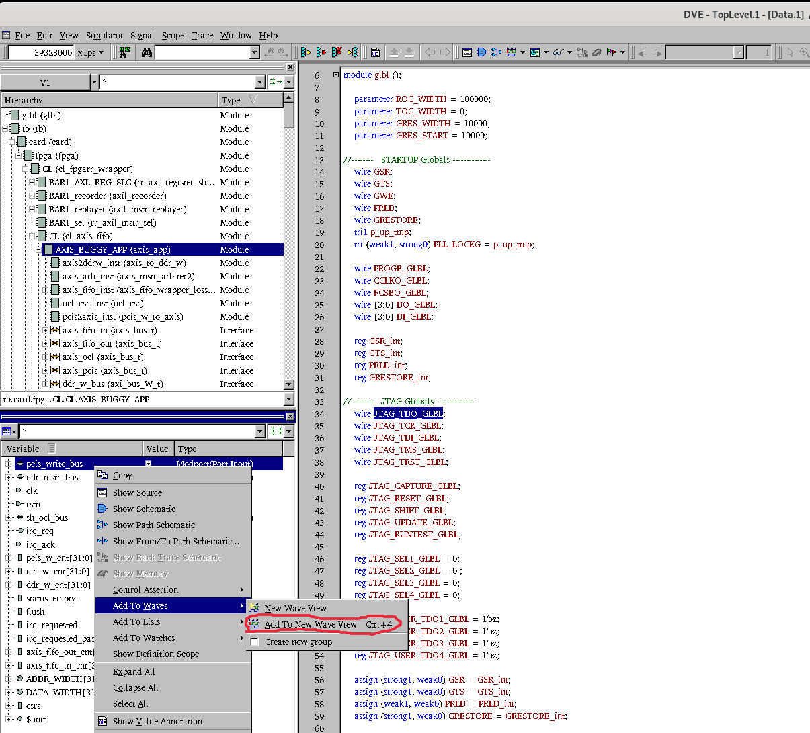
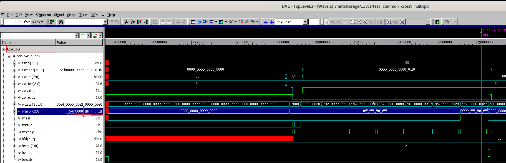
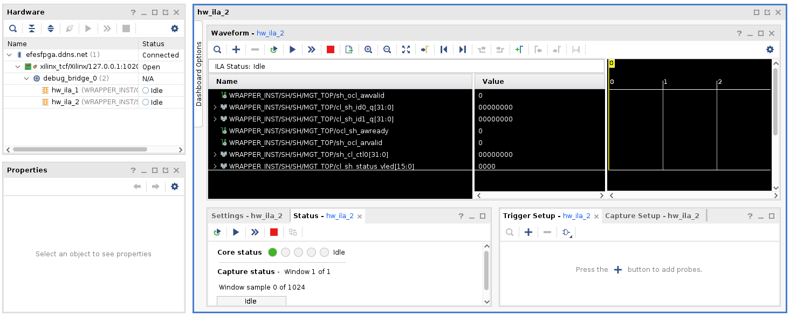
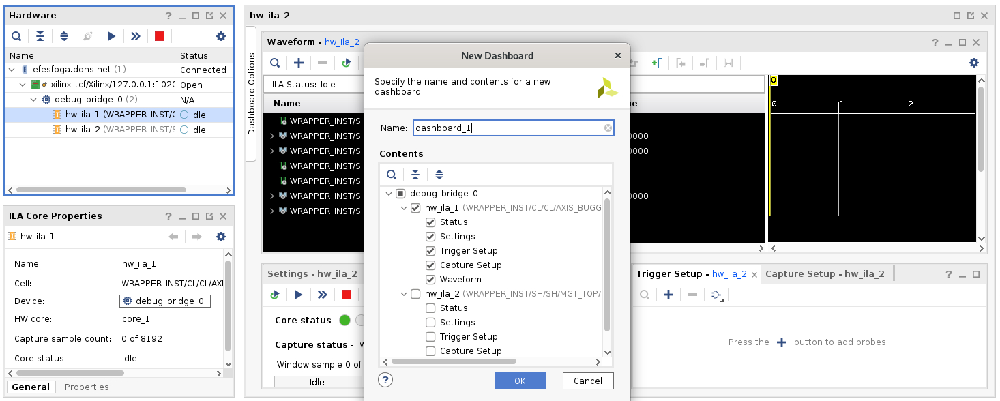
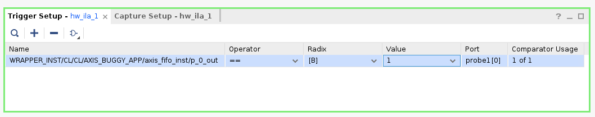
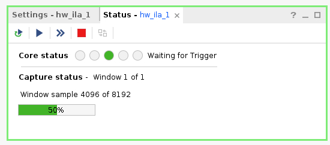
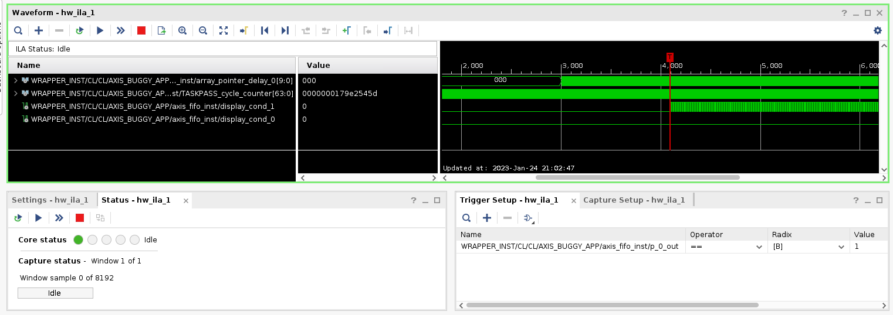

# Introduction
This is the debugging case study (S5.2), which is based on the [Frame FIFO bug](https://github.com/alexforencich/verilog-axis/commit/3d90e80da8e60daf5727e003d3b059e9b21b41da) presented in a prior [bug survey](https://github.com/efeslab/hardware-bugbase/tree/bugs/d4-buffer-overflow-frame-fifo).

The `design` directory contains the [verilog implementation](design/axis_fifo.v) of the buggy Frame FIFO and a simple echo server application built upon it.

The following experiments are expected to take < 30min

# Experiments

## Bug1: Unaligned DMA access
Let us first run this application without triggering the bug.
Recall that during the [Basic Simulation Test](../../../../artifact-eval/README.md#basic-simulation-test), we have already run this application in simulation and it gave correct answers.
However, if we run the same configuration (buffer aligned to 8-byte and start the echo server before initiating DMA) on the actual FPGA hardware, we would get incorrect answers.

(0) Get a command-line access to the `aws` server.

(1) Go to the corresponding software directory
```bash
# assuming we were at the git repo root dir aws-fpga
cd hdk/cl/examples/cl_axis_fifo_buggy/software/runtime
```

(2) Flash a prebuilt FPGA image and trigger the bug with different record/replay configurations
```bash
make bug_dma_alignment
```

(3) Check the expected output messages and files
```bash
# check the stdout of the executions without any record/replay, where incorrect values are non-zero.
# Something went wrong!
less /mnt/output/axis_fifo_hw.elf_8_imm_start_none.log
# check the stdout of the executions with recording and validation enabled, where the incorrect executions is successfully recorded.
less /mnt/output/axis_fifo_hw.elf_8_imm_start_recordv.log
# check the existence of the recorded trace
ls -lh /mnt/output/axis_fifo_hw.elf_8_imm_start_record.dump
# check the recorded trace was also replayed successfully on the actual FPGA
# The "Total violations" will report the any happens-before relationships that are violated during replay
# The "Total content mismatches" will report any output transactions that are different between record and replay
less /mnt/output/axis_fifo_hw.elf_8_imm_start_diff.txt
```

(4) Replay the trace in simulation for debugging

Fortunately, this bug is simple enough that we can debug it in simulation with the help of the recorded incorrect execution trace.
Let us get a GUI access to the `dev` server (because simulation software needs GUI). Open a terminal and copy the trace from the `aws` server
```bash
# assuming we are at the ${HOME} directory
scp ubuntu@efesfpga.ddns.net:/mnt/output/axis_fifo_hw.elf_8_imm_start_record.dump ~/
```

Then go to the simulation directory and replay the trace
```bash
cd ~/aws-fpga/hdk/cl/examples/cl_axis_fifo_buggy/verif/scripts
make AXI_MEMORY_MODEL=1 VCS=1 C_TEST=test_common RR_MODE=replay RR_RECORD_PATH=~/axis_fifo_hw.elf_8_imm_start_record.dump 
```
Note that the full trace would be too large to completely reply in simulation, but a 90-second of replay is enough to triage the problem.
So you should "ctrl+c" that simulation after about 90 seconds and type the "exit" command when you see a "ucli%" prompt.

(5) Debug the replay after aborting the simulation
```bash
make AXI_MEMORY_MODEL=1 VCS=1 C_TEST=test_common RR_MODE=replay RR_RECORD_PATH=~/axis_fifo_hw.elf_8_imm_start_record.dump view
```
A GUI waveform viewer should show up. Let us focus on the following verilog signals to check the transactions replayed from the trace:
  - In the "Hierarchy" window, select `tb->card->fpga->CL->CL->AXIS_BUGGY_APP`
  - Then in the "Variable" window, select `pcis_write_bus`
  - Right click the selected variable; "Add To Waves"; "Add To New Wave View";
  - Expand the `pcis_write_bus` variable and focus on the `wstrb` signal
  - Use "o" to zoom out and "i" to zoom in the waveform. Search for the first burst of the `wstrb`, where you should find the bits in `wstrb` are not all set to 1 for the last transaction (i.e., $wlast == 1$).
  - That means the input transactions are not well-aligned, which will be determined as the root cause of the incorrection execution after more debugging (skipped).

Example screenshot for opening the wave view:

Example screenshot of the unaligned transaction:


(6) Quick mitigation.

After realizing that unaligned buffer has a different behavior on the actual FPGA than in the simulation, we can quickly mitigate the problem by enforcing the buffer allocation aligned to page-boundaries.
```make
# run with 4096-byte alignment
make correct_run
```
The output should show zero incorrect values.

## Bug2: Delayed Start

After mitigating the buffer alignment issues, the buggy FIFO implementation may still cause data loss when the DMA is initiated before certain control registers are set on the FPGA component.

(1) Flash the corresponding FPGA image and trigger the bug with different record/replay configurations
```bash
# assume we were still on `aws` and `hdk/cl/examples/cl_axis_fifo_buggy/software/runtime`
# run with 4096-byte alignment
make bug_delayed_start
```

(2) Check the expected output messages and files
```bash
# check the stdout of the executions without any record/replay, where incorrect values are non-zero.
# Something went wrong and the failure pattern is different from Bug1
less /mnt/output/axis_fifo_hw.elf_4096_delayed_start_none.log
# check the stdout of the executions with recording and validation enabled, where the incorrect executions is successfully recorded.
less /mnt/output/axis_fifo_hw.elf_4096_delayed_start_recordv.log
# check the existence of the recorded trace
ls -lh /mnt/output/axis_fifo_hw.elf_4096_delayed_start_record.dump
# check the recorded trace was also replayed successfully on the actual FPGA
less /mnt/output/axis_fifo_hw.elf_4096_delayed_start_diff.txt
```

(3) Load the LossCheck instrumentation

To demonstrate VIDI can help debugging on the actual FPGA, we also use the LossCheck instrumentation proposed in the prior bug survey.
The instrumented version of the application is located [here](design/axis_fifo_wrapper_losscheck.sv).

Let us load the prebuilt FPGA image of the instrumented application:
```bash
make load_instrumented
```

(4) Setup debugging environment

To debug a program running on the actual FPGA, we need to run vivdao on the `dev` server then connect vivdao with the FPGA on the `aws` server.
```bash
# setup `aws` debugging ports. using tmux is recommended
# run xilinx hardware server in one terminal (it will run in foreground thus you need to keep this terminal alive)
sudo /opt/xilinx/HWSRVR/bin/hw_server
# run AWS fpga virtual jtag proxy in another terminal (it will run in foreground thus you need to keep this terminal alive)
sudo fpga-start-virtual-jtag -P 10201 -S 0
```
**NOTE:** The debugging environment would be reset everytime the FPGA is flashed. Please remember to execute this step again if you happen to go back to (3).

(5) Get VNC access to the `dev` server and open vivado in a GUI terminal on the `dev` server
```bash
# assume we are using terminal in a GUI environment of `dev`
cd hdk/cl/examples/cl_axis_fifo_buggy/
# the following tcl script will connect to the debugging environment on the `aws` server
PREBUILT=${HOME}/aws-fpga-prebuilt vivado -mode tcl -source losscheck.jtag.ila.tcl
```

You should now see a Vivado Hardware Manager window like this:



Then, double click `hw_ila_1` in the `Hardware` panel, and select the following signals:



Add `WRAPPER_INST/CL/CL/AXIS_BUGGY_APP/axis_fifo_inst/p_0_out` as a probe in `Trigger Setup - hw_ila_1` panel:


And change `Value` from `X` to `1`. You should see the following now:



Then click the start buttom (i.e., a triangle-shaped buttom) in the `Status - hw_ila_1` panel. You should see that the debugging logic is waiting to be triggered:



(6) Go back to the `aws` server and run the replay:
```
make replay_delayed_start
```

(7) Go back to the vivado window on the `dev` VNC

At the Vivado Hardware Manager window, you should see that the debugging core is triggered, and the `Status` goes back to `Idle` again.



As we can see from the waveform, the debugging logic was successfully triggered when `display_cond_1` becomes `1`.
This means that the LossCheck instrumentation found a register to be overwritten before propagate to another register.

The signal named `array_pointer_delay_0` tracks overwrites that occur in the 0-th (i.e., first) instrumented buffer in the application source code.
The value of `array_pointer_delay_0` in the waveform determines the locations of overwrites, which are essentially offsets in the first instrumented buffer.
The value of `TASKPASS_cycle_counter` indicates the timestamp when the overwrite occurs.

As a result, the developer localizes the data loss bug with the help of Vidi and LossCheck.
