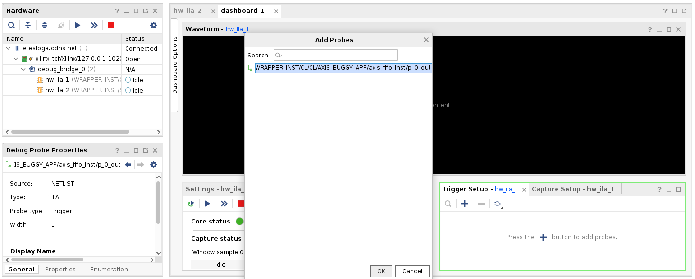

# Introduction
This is the debugging case study (S5.1), which is based on the [Frame FIFO bug](https://github.com/alexforencich/verilog-axis/commit/3d90e80da8e60daf5727e003d3b059e9b21b41da) presented in a prior [bug survey](https://github.com/efeslab/hardware-bugbase/tree/bugs/d4-buffer-overflow-frame-fifo).

The `design` directory contains the [verilog implementation](design/axis_fifo.v) of the buggy Frame FIFO.

# Experiments

## Setup

### The correct run
Let us first run this application without triggering the bug.
```make
make correct_run
```
### Bug1: Unaligned DMA access

```make
make bug_dma_alignment
```

### Bug2: Delayed Start
#### 1. run
```make
make bug_delayed_start
```
#### 2. check output
#### 3. check losscheck results in vivado ILA

######  a. setup remote ILA access on the F1 VM
  ```
  # in one terminal
  sudo /opt/xilinx/HWSRVR/bin/hw_server
  # in another terminal
  sudo fpga-start-virtual-jtag -P 10201 -S 0
  ```

######  b. open vivado in the dev server
  ```bash
  vivado -mode tcl -source losscheck.jtag.ila.tcl
  ```
  You should now see a Vivado Hardware Manager window like this:

  
  
  Then, double click `hw_ila_1` in the `Hardware` panel, and select the following signals:

  

  Add `WRAPPER_INST/CL/CL/AXIS_BUGGY_APP/axis_fifo_inst/p_0_out` as a probe in `Trigger Setup - hw_ila_1` panel:

  

  And change `Value` from `X` to `1`. You should see the following now:

  

  Then click the start buttom (i.e., a triangle-shaped buttom) in the `Status - hw_ila_1` panel. You should see that the debugging logic is waiting to be triggered:

  

  Run the replay on the AWS VM via the following command:
  ```
  make replay_bug
  ```
  At the Vivado Hardware Manager window, you should see that the debugging core is triggered, and the `Status` goes back to `Idle` again.

  

  As we can see from the waveform, the debugging logic is triggered because of `display_cond_1` becomes `1`. This means the code instrumented by LossCheck found that a register was overwritten before propagating to another register. The value of `array_pointer_delay_0` at the trigger point indicates the index in the array where the overwrite occurs, and the value of `TASKPASS_cycle_counter` indicates the timestamp when the overwrite occurs. As a result, the developer localizes the data loss bug with the help of Vidi and LossCheck.